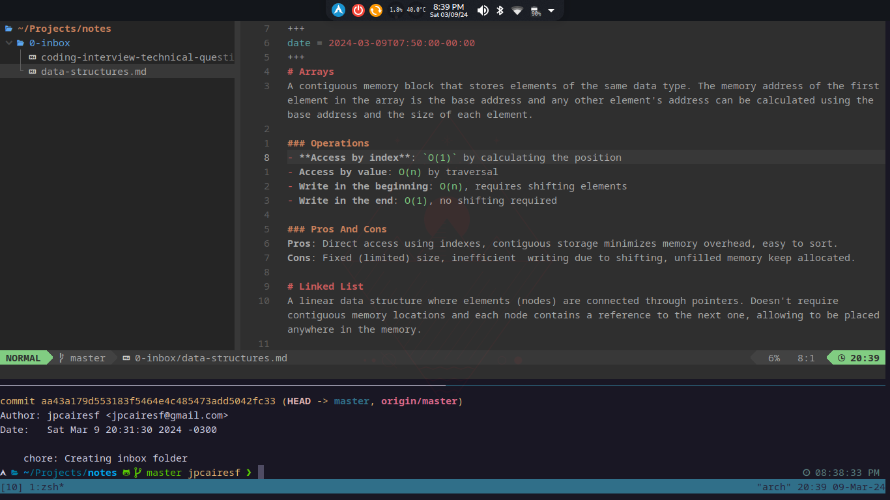

## Hello Mischa, Hello PARA
I recentely discorved this guy named Mischa van den Burg on Youtube. He is inspiring me to implement many tools and practices in my workflow for productivity.

Watch his video to understand: https://youtu.be/zIGJ8NTHF4k?t=3000

Also a reference for PARA method: https://fortelabs.com/blog/para/

## Workspace
Now take a look at that source of motivation for coding that I call my workspace.

If you want to use my configurations, you can find my dotfiles [here](https://github.com/jpcairesf/dotfiles).
